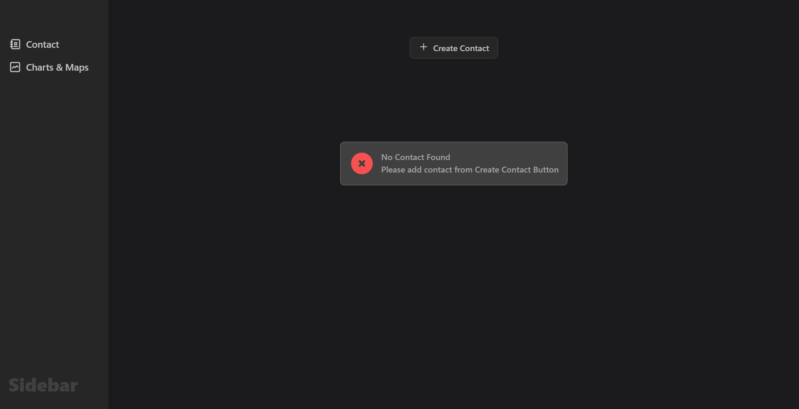
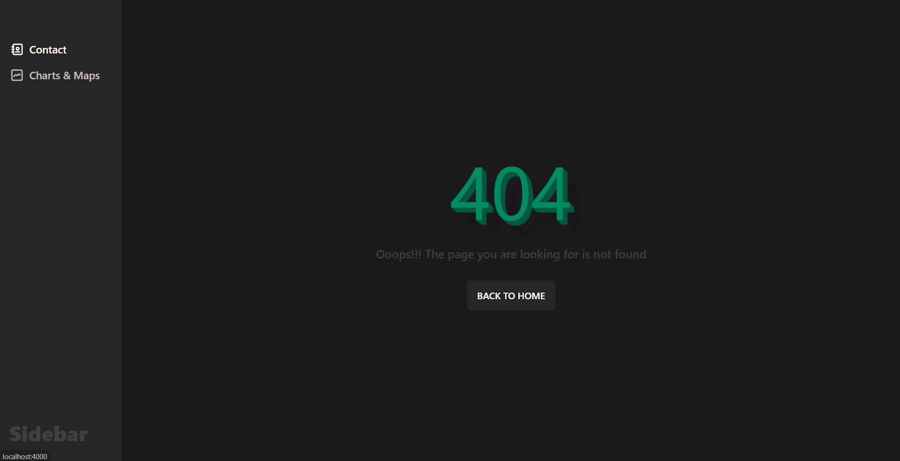
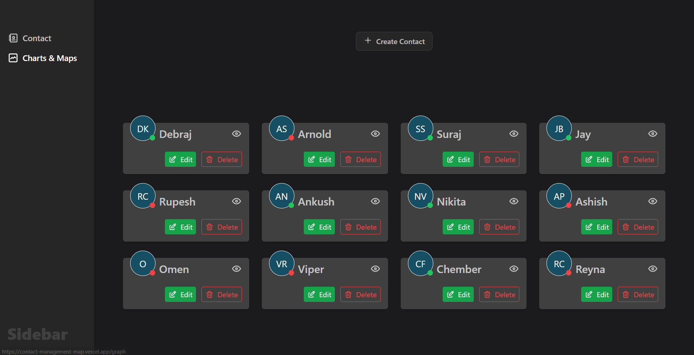
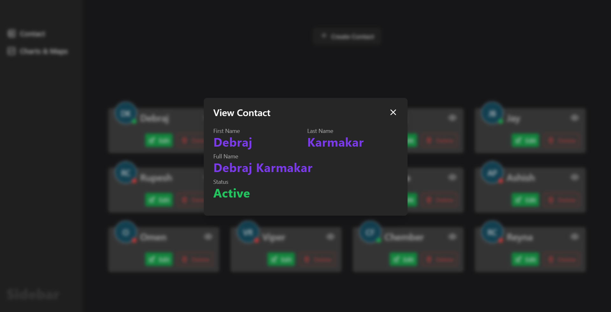
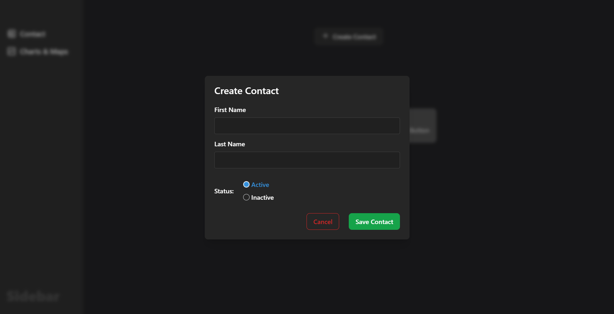
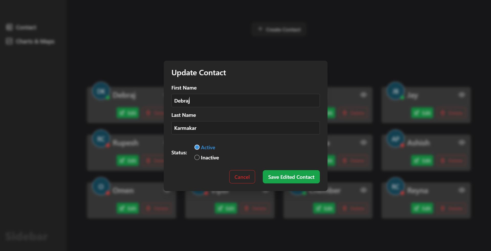
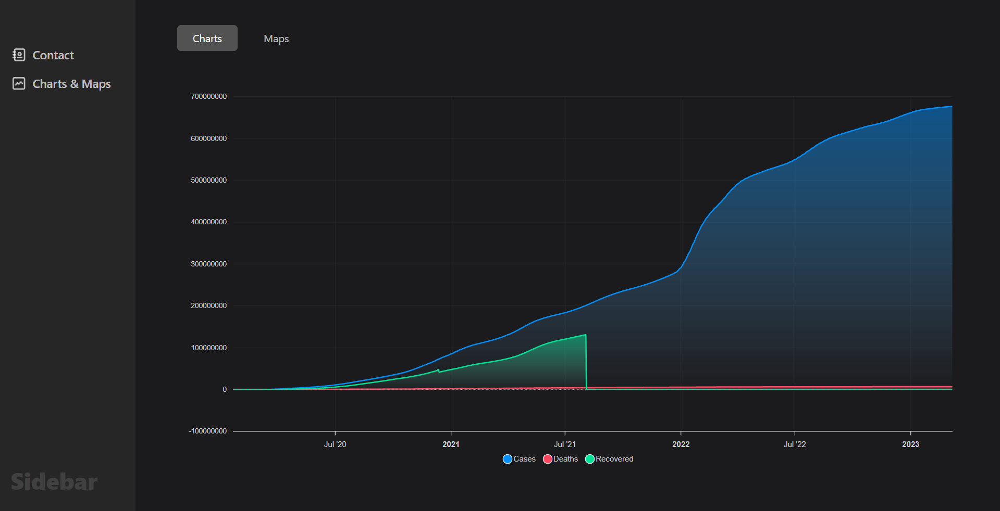
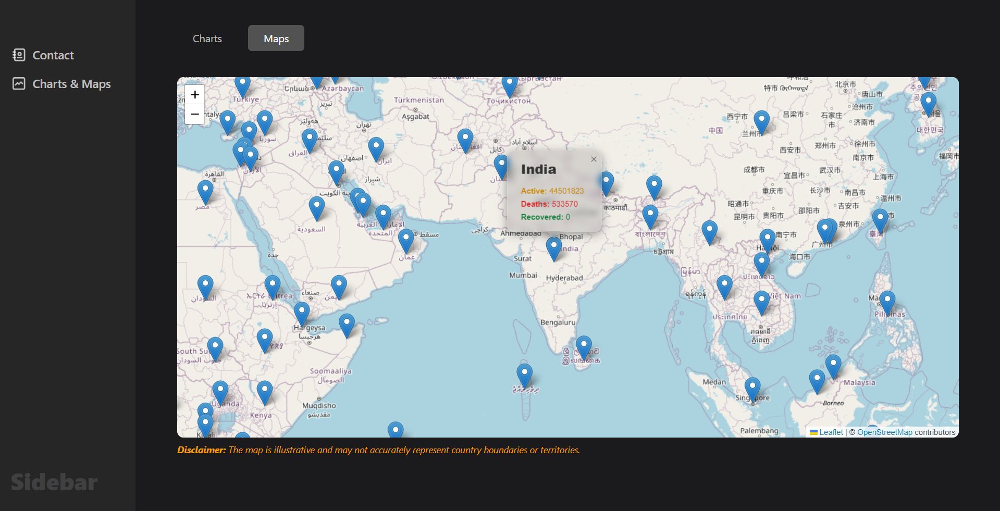

# 📞 Contact Management Map

    A React application for managing contacts and visualizing COVID-19 data on an interactive map.

  🌐 Website: [Live link](https://contact-management-map.vercel.app/)

## 😍 UI

<p align="center">
  
  
  
  
  
  
  
  
</p>

## 🤌🏻 Overview

The Contact Management Map is a modern, responsive React application that allows users to manage contacts efficiently and visualize COVID-19 data on a map. Built with cutting-edge technologies such as React, TypeScript, and Vite, the app ensures a fast and efficient development experience while providing a seamless user experience across different devices.

## 🎉 Features

- **Contact Management**: Perform CRUD (Create, Read, Update, Delete) operations on contacts. Each contact includes fields like first name, last name, and status.
- **COVID-19 Data Visualization**: Display COVID-19 data on an interactive map using Leaflet and present detailed graphs using ApexCharts.
- **Responsive Design**: Optimized for both desktop and mobile devices, ensuring a consistent and user-friendly experience.
- **Data Validation**: Integrated validation mechanisms to ensure the accuracy and consistency of user inputs.
- **Error Handling**: Robust error handling to manage unexpected errors gracefully, enhancing the overall user experience.

## 🕹️ Technologies Used

- **React**: JavaScript library for building user interfaces.
- **TypeScript**: Superset of JavaScript that adds optional static typing.
- **Vite**: Fast development server and build tool.
- **React Router**: Client-side routing library for React.
- **React Query**: Data fetching and caching library for React.
- **Redux Toolkit**: State management tool.
- **Leaflet**: Library for interactive maps.
- **ApexCharts**: Modern charting library.
- **Tailwind CSS**: Utility-first CSS framework.
  
## 🪄 Getting Started

### ☝🏻 Prerequisites

Before you start, ensure you have the following installed:

- **Node.js** (version 14 or higher)
- **npm** (version 6 or higher) or **yarn** (version 1 or higher)
- A code editor or IDE of your choice

### ⏩ Installation

Follow these steps to set up the project locally:

1. **Clone the repository:**
   ```bash
   git clone https://github.com/debrajhyper/contact-management-map.git
   cd contact-management-map
   ```
2. **Install dependencies:**
   ```bash
   npm install
   ```
3. **Start the development server:**
   ```bash
   npx vite --port=4000
   ```
4. **Open the application in your web browser:**
   ```
   http://localhost:4000
   ```

### 📦 Build and Deployment

To build the application for production, run:

```bash
npm run build
```

The production-ready build will be generated in the `dist` folder.

To deploy the application, you can use a hosting platform of your choice, such as **Vercel**, **Netlify**, or **AWS**.

## 🎄 Project Structure

The project follows a modular structure to ensure scalability and maintainability:

```bash
src
├── api
│   └── index.ts
├── app
│   └── App.tsx
├── components
│   ├── Card
│   │   └── Card.tsx
│   ├── Error
│   │   └── Error.tsx
│   ├── Graph
│   │   ├── ChartView.tsx
│   │   └── MapView.tsx
│   ├── Input
│   │   ├── RadioInput.tsx
│   │   └── TextInput.tsx
│   ├── Loader
│   │   └── Loader.tsx
│   ├── Modal
│   │   └── Modal.tsx
│   ├── Sidebar
│   │   ├── Sidebar.tsx
│   │   └── data.ts
│   └── index.ts
├── constants
│   └── index.ts
├── routes
│   └── index.ts
├── services
│   ├── contactsSlice.ts
│   ├── ModalSlice.ts
│   └── store.ts
├── utils
│   └── index.ts
├── view
│   ├── ContactPage.tsx
│   ├── GraphPage.tsx
│   ├── Layout.tsx
│   └── NotFound.tsx
└── index.ts
```

## 🙏🏻 Acknowledgments

- **[Debraj Karmakar](https://www.linkedin.com/in/debrajkarmakar010/)** - Creator and maintainer of the project.